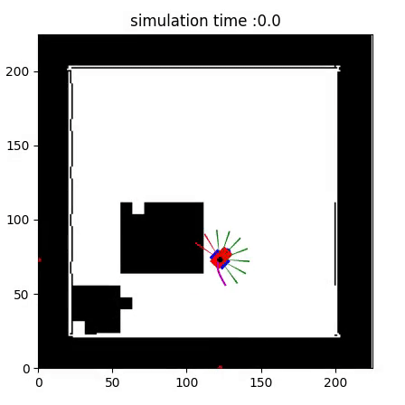

# Mobile Robot

### This is a simulator of differential drive mobile robot. And by default there is a obstacle avoidance algorithm working on initial start. One of the major portion of the simulator is the environment which in this simulator is essentially a binary image of the top-view of the environment. User can add as many mobile robot as they want just by creating object of mobile robot class. So this can also be used to simulate group of mobile robots

## Features

- Robot is equipped with nine low range IR sensors to measure the distance around robot. The ranges and cone angle of the sensors can easily be modified.
- Robot also consists of 2 motor with encoders for odometry.
- A variety of obstacles and environments can be dealt with as it is independent of the default environment. User can add their own custom made binary image environment.
- Written in python, gives a great introduction to the matplotlib plotting and interactive mode.
- Dual view mode. press 'v' to toggle between views (Absolute view and Relative view).

## Uses

- Can be used to simulate algorithms like path planning, localization, obstacle avoidance, go-to-goal, follow-walls behaviours.
- Various noise parameters can be tweaked to match the real components value noise.
- Its a great way to practice the mathematics behind the working of mobile robot.
- This is a low level simulator with very little to no abstraction of details and that is why it is easy to understand the working of the simulator from scratch.

